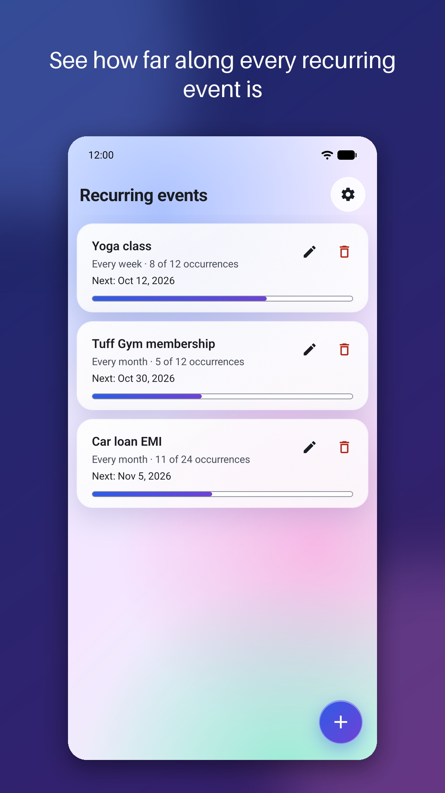
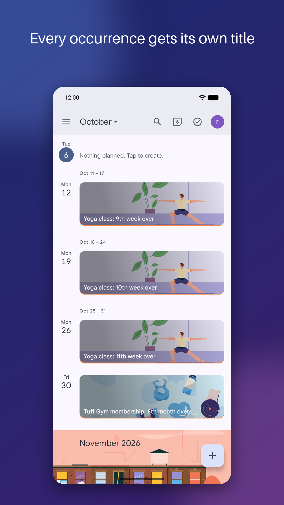
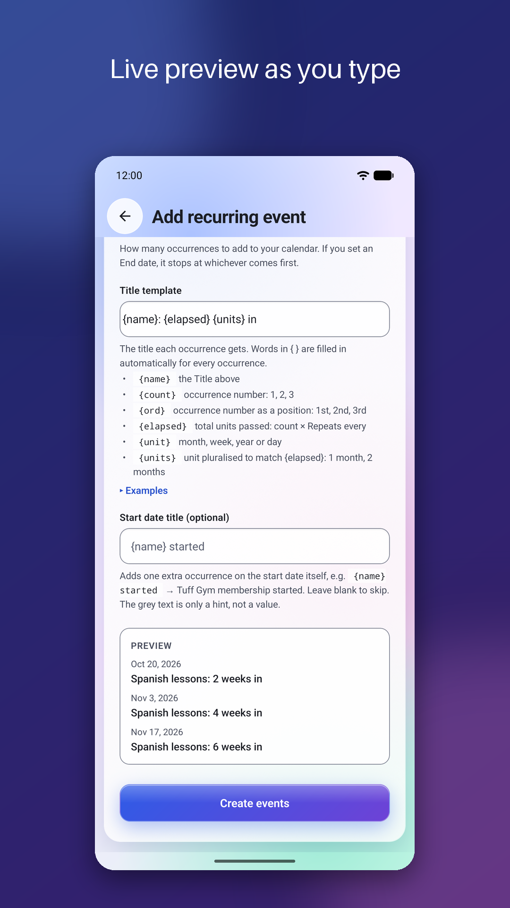
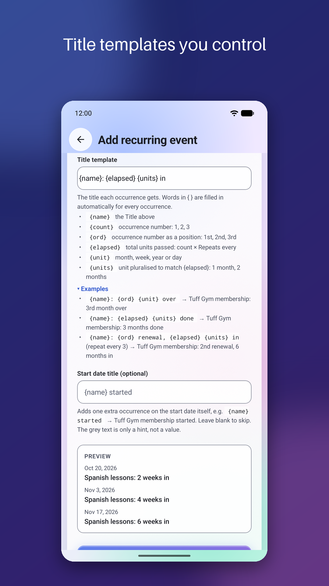
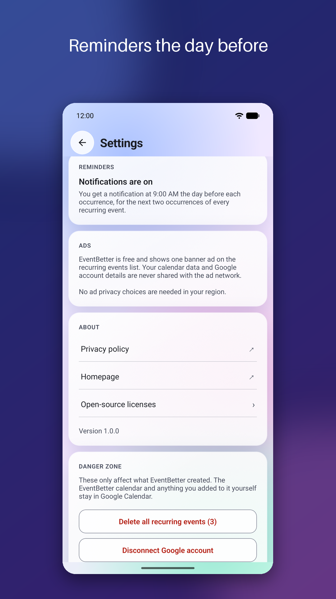
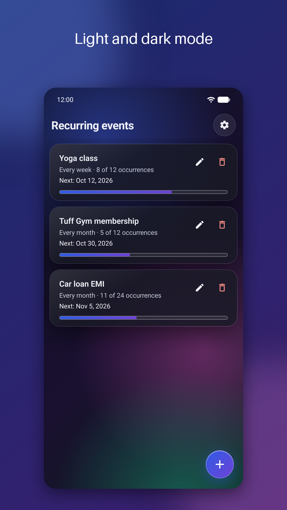
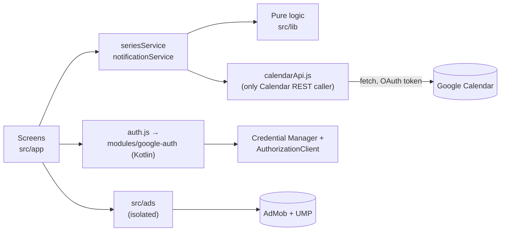

<p align="center">
  
</p>

<h1 align="center">EventBetter</h1>

<p align="center">
  <strong>Recurring Google Calendar events where every occurrence has its own title.</strong><br>
  See at a glance how far along you are: the 5th month of a membership, the 11th loan payment, the 10th week of a class.
</p>

<p align="center">
  <a href="https://jumppack.online/eventbetter/">Website</a> ·
  <a href="https://jumppack.online/eventbetter/privacy/">Privacy policy</a> ·
  <a href="#functional-specification">Functional spec</a> ·
  <a href="#development">Development</a>
</p>

<p align="center">
  
  
  
  
</p>

---

## The problem

Google Calendar gives every occurrence of a recurring event the **same title**. "Gym membership" on the 30th of every month tells you nothing about how long you've been going, how many payments are left on a loan, or which week of a course you're in.

## The fix

EventBetter creates **one real recurring series** in Google Calendar, then gives each occurrence its own numbered title:

| Date | Title in Google Calendar |
|---|---|
| Oct 30, 2026 | Tuff Gym membership: 1st month over |
| Nov 30, 2026 | Tuff Gym membership: 2nd month over |
| … | … |
| Feb 28, 2027 | Tuff Gym membership: 5th month over *(clamped to month end)* |
| … | … |
| Sep 30, 2027 | Tuff Gym membership: 12th month over |

Because it's a genuine recurring series, it behaves like any other: it syncs to every device, shows up in widgets and on your watch, and deleting any occurrence in Google Calendar offers **"All events"**.

## Screenshots

| | | |
|:-:|:-:|:-:|
|  |  |  |
| **Track progress** on every recurring event | **Every occurrence** gets its own title | **Live preview** as you type |
|  |  |  |
| **Title templates** you control | **Reminders** the day before | **Light and dark** mode |

## Who it's for

- **Memberships and subscriptions you pay for:** gyms, clubs, streaming, insurance. "7th month over" makes renewal decisions obvious.
- **Loans and instalments:** EMIs, car loans, rent. "Car loan EMI: 11th payment done" shows exactly where you stand.
- **Courses and habits:** weekly classes, therapy sessions, training plans, language lessons ("Spanish lessons: 6 weeks in").
- **Milestones and anniversaries:** sobriety, relationships, a baby's months, time since a move or a new job.
- **Anything that repeats** where the count matters as much as the date.

## Why people will like it

- **No new app to check.** The value lives in Google Calendar, where people already look. EventBetter is only needed to create, edit or delete.
- **Correct dates, every time.** Month ends are handled properly: a series starting on the 31st lands on Feb 28/29, then back on the 31st. Leap days work. Tested across 16,000 date combinations and verified against Google's own engine.
- **Private by design.** No account, no server, no tracking of your calendar. Data goes only between your phone and Google.
- **Safe with your calendar.** Everything goes into a separate "EventBetter" calendar; your existing events are never touched.
- **Free.** One small banner ad on the list screen, nothing else.

---

## Functional specification

### 1. Concepts

| Term | Meaning |
|---|---|
| **Recurring event** | What the user creates, such as "Tuff Gym membership, monthly, 12 times". Called a *series* in code. |
| **Occurrence** | One dated item of that recurring event in Google Calendar, each with its own title. |
| **Start event** | Optional extra occurrence on the start date itself (for example "Tuff Gym membership started"). |
| **EventBetter calendar** | A secondary Google calendar the app creates and owns. The app never reads or writes any other calendar. |

### 2. Screens

#### 2.1 Sign in
- App name, a one-line explanation and **Continue with Google**.
- Sign-in requests basic profile only. Before the Calendar permission prompt, a separate screen explains in plain words why Calendar access is needed and what the app will (and won't) do.
- If the user grants only part of the access, the app explains what's missing and lets them retry.

#### 2.2 Recurring events (home)
- One card per recurring event, showing:
  - **name**
  - **frequency** ("Every week", "Every 3 months")
  - **progress** ("5 of 12 occurrences", counting numbered occurrences dated today or earlier) with a progress bar
  - **next occurrence** date
- Each card has **edit** and **delete** icons; tapping the card opens edit. Delete always confirms and states how many occurrences will be removed.
- Pull to refresh, an explanatory empty state, and a floating **+** button.
- A single anchored banner ad at the bottom of this screen only.

#### 2.3 Add / edit recurring event

| Field | Behaviour | Default |
|---|---|---|
| Title | Name of the recurring event | required |
| Start date | Native Android date picker | today |
| Repeats every *n* *unit* | One inline row; unit is day, week, month or year and pluralizes with *n* | 1 month |
| End date (optional) | Stops occurrences after this date; has a **Clear** button | none |
| Number of occurrences | Stops after this many, whichever comes first with the end date | 12 (max 500) |
| Title template | Placeholders filled per occurrence, with a collapsible guide and examples | `{name}: {ord} {unit} over` |
| Start date title (optional) | Adds the start event with `count = 0` | none |

- **Live preview** of the first three dates and titles updates as the user types.
- Inline, per-field validation; empty optional fields fall back to defaults.
- Creation shows step-by-step progress (renaming many occurrences takes a few seconds) and disables the button while it runs; leaving the screen mid-way is blocked.
- Duplicate protection: the same name, start date, frequency and interval can't be created twice.
- **Edit** recreates the recurring event from the edited values after a confirmation. The new one is created first and the old one removed afterwards, so a failed edit never loses data. Edit mode also shows **Delete**.

#### 2.4 Settings
- **Account:** signed-in name and email, Sign out.
- **Reminders:** notification permission state, with a link to system settings if it was denied.
- **Ads:** what the ad shows and doesn't use; **Manage ad privacy choices** where the region requires it (EEA/UK, US states).
- **About:** privacy policy, homepage, open-source licenses, app version.
- **Danger zone:**
  - **Delete all recurring events:** removes every series one by one with progress. The calendar itself and anything the user added to it stay.
  - **Disconnect Google account:** revokes access, clears local state, and first offers to delete the events. Both actions confirm with real counts.

### 3. Title templates

| Placeholder | Meaning | Example |
|---|---|---|
| `{name}` | The Title field | Tuff Gym membership |
| `{count}` | Occurrence number | 1, 2, 3 |
| `{ord}` | Occurrence number as an ordinal | 1st, 2nd, 3rd, 11th, 12th, 13th, 21st |
| `{elapsed}` | count × repeat-every | every 3 months: 3, 6, 9 |
| `{unit}` | day, week, month or year | month |
| `{units}` | unit pluralized to match `{elapsed}` | month, months |

Unknown placeholders are left as literal text. Examples:

- `{name}: {ord} {unit} over` → *Tuff Gym membership: 3rd month over*
- `{name}: {elapsed} {units} done` → *Tuff Gym membership: 3 months done*
- `{name}: {ord} renewal, {elapsed} {units} in` (every 3 months) → *Tuff Gym membership: 2nd renewal, 6 months in*

### 4. Scheduling rules

- Dates are calendar dates in the user's local time zone, never shifted by UTC conversion. This is tested in India (IST, +05:30), UTC, Los Angeles and Auckland.
- Monthly and yearly occurrences are computed from the **original start date** and clamp to the month's last day (Jan 31 → Feb 28/29 → Mar 31).
- Occurrences are all-day events. They stop at whichever comes first: the end date or the number of occurrences.
- In Google Calendar, each recurring event is a single RRULE series (`FREQ`, `INTERVAL`, `COUNT`, plus `BYMONTHDAY…;BYSETPOS=-1` for month-end and leap-day starts). Before titles are written, the app checks that Google's generated dates match its own plan exactly, and refuses to continue if they don't.

### 5. Reminders

- **Google Calendar reminder** on every occurrence: a popup at **9:00 AM the day before**.
- **Phone notifications** at the same time, such as "Tomorrow: Tuff Gym membership: 3rd month over":
  - Only the next 2 occurrences per recurring event are scheduled, with at most 50 in total.
  - Everything is rescheduled from Calendar data on launch, on returning to the app, and after any change, so a reinstall or a new phone recovers automatically. Reminders also survive reboots.
  - Notification permission is requested after the first recurring event is created, never at launch.
  - No exact-alarm permission is used, so Android may deliver a reminder a few minutes late.

### 6. Ads and consent

- One anchored banner on the home screen; no interstitials, no rewarded ads.
- Google's consent form (UMP) runs before any ad loads. The ads SDK starts only if consent allows it.
- **Google user data is never shared with the ad SDK or used for targeting.** No keywords and no content URLs are passed. All ad code is isolated in `src/ads/`, and a test fails if it ever imports calendar or auth code.
- Development and preview builds always use Google's test ads.

### 7. Privacy and permissions

| Access | Why |
|---|---|
| `calendar.app.created` | Create the EventBetter calendar and manage only the events in it |
| `calendar.calendarlist.readonly` | Find the EventBetter calendar again after a reinstall |
| Notifications | Day-before reminders (optional) |
| Advertising ID | Required by the AdMob banner |

- No EventBetter server, database or analytics. Tokens come from Google's SDK on demand and are never stored by the app.
- Both Calendar scopes are classified by Google as non-sensitive. The OAuth app is in production with verified branding.
- Compliant with the Google API Services User Data Policy, including the Limited Use requirements. Full details are in the [privacy policy](https://jumppack.online/eventbetter/privacy/).

### 8. Data stored

| Where | What |
|---|---|
| Google Calendar (user's account) | The EventBetter calendar, its recurring events, and in private extended properties a dedupe key, the name and a compact copy of the form input (used to edit) |
| On the phone (AsyncStorage) | The EventBetter calendar ID and the map of scheduled notifications |
| Nowhere else | — |

### 9. Out of scope for v1

- iOS. The code avoids Android-only APIs where it costs nothing, but there's no iOS configuration.
- Writing to calendars other than the app's own.
- In-place editing of individual occurrences (edit recreates the series).
- Paid tiers, interstitial ads, accounts or sync beyond Google Calendar.

---

## Architecture



| Layer | Contents |
|---|---|
| `src/app/` | Expo Router screens: sign-in, calendar access, list, add, edit, settings, licenses |
| `src/components/` | Glass UI kit, form fields, `SeriesForm`, session and series providers, theme tokens |
| `src/lib/` | Pure, fully tested logic: templates, schedule, RRULE, validation, series planning, progress summary, reminder planning |
| `src/services/` | Orchestration: create/update/delete/list series, notification sync |
| `src/api/` | `calendarApi.js` (throttled, retrying REST client) and `auth.js` |
| `src/ads/` | Banner, consent and SDK start-up, with no imports from the rest of the app |
| `modules/google-auth/` | Local Expo module wrapping Google's current Android sign-in and authorization APIs |
| `website/` | Static homepage, privacy policy and `app-ads.txt` for jumppack.online (Cloudflare Workers) |
| `scripts/` | Icon, store-graphic and screenshot generators; license list generator |

### Tech stack

- **App:** Expo SDK 57, React Native 0.86 (New Architecture), Expo Router, JavaScript.
- **Google:** Calendar REST API v3, Credential Manager (`androidx.credentials`, `googleid`), `play-services-auth` AuthorizationClient.
- **Device:** `expo-notifications`, `expo-blur`, `@react-native-community/datetimepicker`, AsyncStorage.
- **Ads:** `react-native-google-mobile-ads` with Google UMP.
- **Builds:** EAS Build and EAS Submit.
- **Tests:** Jest, run in four time zones; `rrule` as an offline cross-check.
- **Web:** static HTML on Cloudflare Workers static assets.

---

## Development

### Prerequisites

- Node.js LTS and npm
- An [Expo](https://expo.dev) account (`npx eas-cli@latest login`)
- An Android phone for the development build. The app uses native modules, so **Expo Go won't work**.
- Your own Google Cloud project if you fork this:
  - the Calendar API enabled
  - an OAuth consent screen
  - a **Web** client ID in `src/config/google.js`
  - an **Android** client per signing key (package name + SHA-1)

### Run it

```bash
npm install
```

```bash
npx eas-cli@latest build --profile development --platform android
```

Install the APK from the build page on your phone, then:

```bash
npx expo start --dev-client
```

JavaScript changes reload instantly. Adding or upgrading a native library needs a new development build.

### Test

```bash
npm test
```

Every suite runs in Asia/Kolkata, UTC, America/Los_Angeles and Pacific/Auckland. The suite includes:
- RRULE expansion checks over about 16,000 series
- a WCAG AA contrast test for both themes
- ad-isolation and terminology guards
- website policy checks

`npm run test:live` runs the month-end check against the real Calendar API. It needs an access token in `GOOGLE_ACCESS_TOKEN` and uses a throwaway calendar.

### Build profiles

| Profile | Output | Ads | Use |
|---|---|---|---|
| `development` | APK with dev menu | test | Day-to-day development |
| `preview` | Release-mode APK | test | Device testing, screenshots |
| `production` | Signed `.aab`, auto-incremented version code | real | Google Play |

```bash
npx eas-cli@latest build --profile production --platform android
```

Store copy, Play Console form answers and release steps are in [`docs/play-store.md`](docs/play-store.md). OAuth verification notes are in [`docs/oauth-verification.md`](docs/oauth-verification.md).

### Assets

```bash
python3 scripts/generate-icons.py
```

```bash
python3 scripts/frame-screenshots.py
```

```bash
npm run licenses
```

These regenerate, in order: the app icons, splash screen, notification icon, Play icon and feature graphic; the Play screenshots, framed from `screenshots/raw/`; and the open-source licenses screen.

---

## Status and roadmap

- [x] Core scheduling logic with multi-time-zone tests
- [x] Google sign-in and incremental Calendar authorization
- [x] Create, list, edit and delete recurring events with live preview
- [x] Calendar reminders and local notifications
- [x] AdMob banner with Google consent
- [x] Glass design, light and dark mode, AA contrast
- [x] Website, privacy policy, verified OAuth branding
- [x] Google Play closed testing (October 2026)
- [ ] Production release on Google Play
- [ ] Ideas under consideration: home-screen widget, more reminder options, localization (Hindi first)

## Contributing

Issues and pull requests are welcome. Please:
- run `npm test` before opening a PR
- keep the logic in `src/lib/` pure and tested
- never pass Google user data to the ads module

Use "recurring event" and "occurrence" in anything user-facing.

Questions or feedback: **support@jumppack.online**

## License

[MIT](LICENSE) © 2026 jumppack
